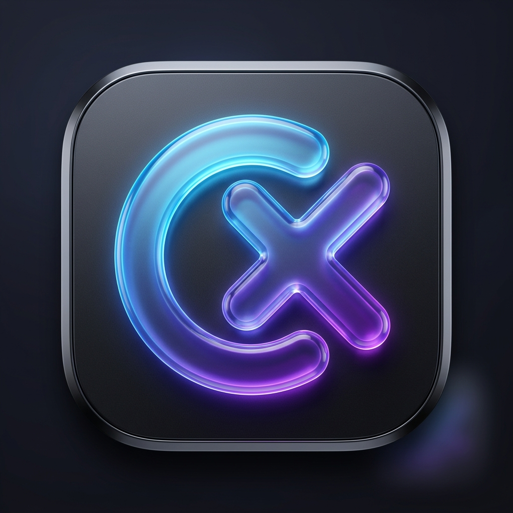
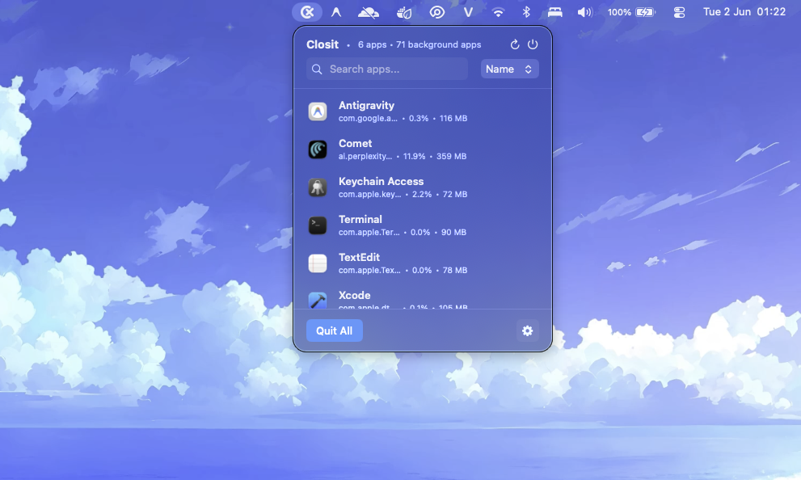

<div align="center">
  
  <h1>Closit</h1>
  <p><strong>A smart, elegant menu bar utility for macOS that automatically quits unused apps to free up memory and save battery.</strong></p>

  <p>
    <a href="https://github.com/khanhworktime/Closit/releases"></a>
    
    
    <a href="https://ko-fi.com/kristhoang"></a>
  </p>
</div>

<br/>

<div align="center">
  
</div>

<br/>

## ✨ Features

- 🔋 **Save Battery & Memory**: Automatically detects and quits applications that have been idle for a specified threshold.
- 🎯 **Smart Whitelisting**: Keep your important apps running. Essential system processes are protected by default.
- 👻 **Background App Detection**: Uncover hidden daemons and background tasks running silently on your Mac.
- 🎨 **Native SwiftUI Experience**: Beautiful, premium interface designed exclusively for macOS with smooth animations and dynamic layouts.
- ⚡️ **Lightweight**: Runs quietly in your menu bar with near-zero performance overhead.

## 🚀 Installation

1. Go to the [Releases](https://github.com/khanhworktime/Closit/releases) page.
2. Download the latest `Closit.dmg`.
3. Open the DMG and drag **Closit** into your `Applications` folder.
4. Launch Closit and enjoy a cleaner, faster Mac!

*(Note: Closit requires macOS 14.0 or later).*

## 🛠 Building from Source

Closit uses `xcodegen` to generate the Xcode project cleanly without merge conflicts.

### Prerequisites
- Xcode 15.0+
- macOS 14.0+
- [XcodeGen](https://github.com/yonaskolb/XcodeGen) (`brew install xcodegen`)

### Steps

```bash
# 1. Clone the repository
git clone https://github.com/khanhworktime/Closit.git
cd Closit

# 2. Generate the Xcode project
xcodegen generate

# 3. Open in Xcode
open Closit.xcodeproj
```

You can also build and package the DMG directly using the included script:
```bash
./scripts/package-dmg.sh
```

## 💖 Support

If you find Closit helpful and want to support its development, consider buying me a coffee!

<a href='https://ko-fi.com/kristhoang' target='_blank'></a>

## 📄 License

This project is open-source and available under the MIT License.

---
<div align="center">
  <i>Designed and developed with ❤️ by <a href="https://github.com/khanhworktime">@khanhworktime</a></i><br>
  <i><a href="mailto:krist.dev.vn@gmail.com">krist.dev.vn@gmail.com</a></i>
</div>
